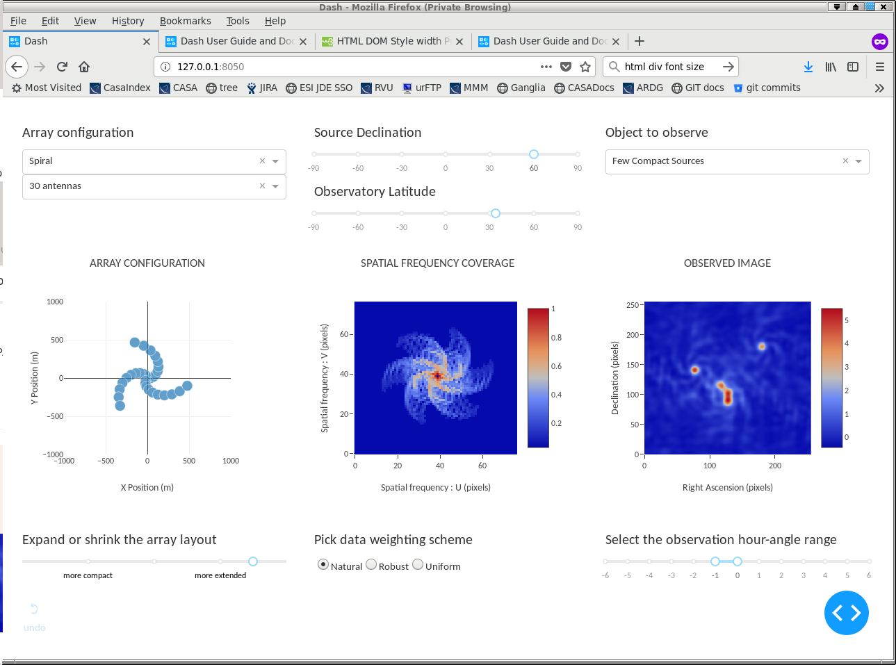

# ImagingSimulator
An interactive tool to demonstrate how an imaging radio interferometer works.

Supported Features :

- Select array configurations and observation setup options
- Select of types of sources to observe
- Choose the time duration of the observation and a data weighting scheme
- Display antenna array configuration, spatial frequency coverage and the observed image. 

Example Screenshot : 

More example screenshots are in the Docs directory.

-------------------------------------------------------------------------------------------------

Run the simulator :

- Setup a local python environment (if needed) with numpy, matplotlib, ipython and dash : 

  - export PPY=`which python2.7`

  - virtualenv -p $PPY --setuptools ./local_python

  - ./local_python/bin/pip install --upgrade pip

  - ./local_python/bin/pip install --upgrade numpy matplotlib ipython dash

- Run the app as   ./local_python/bin/ipython simmer.py

- You should see : 

  - Running on http://127.0.0.1:8050

  - Debugger PIN: 650-504-788
  
- Point your browser to  http://127.0.0.1:8050/

