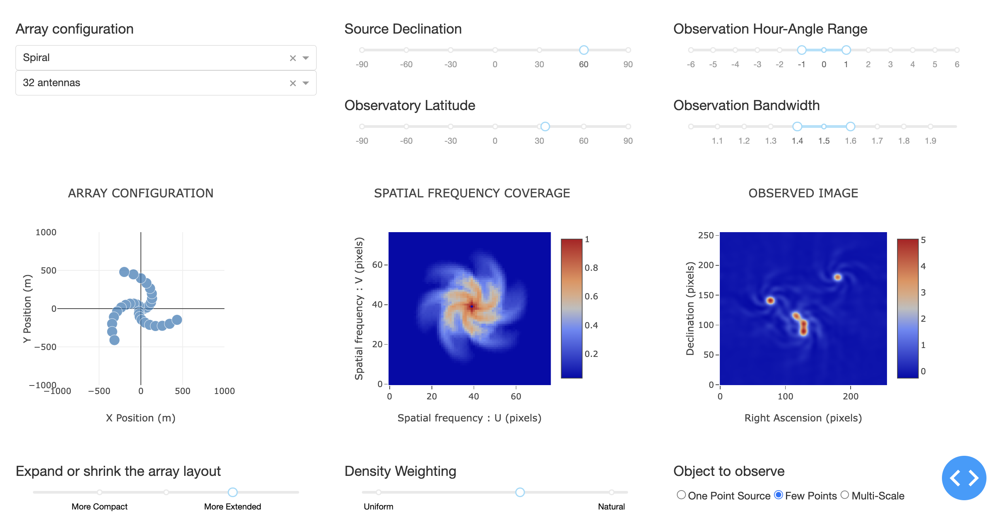

# ImagingSimulator
An interactive tool to demonstrate how an imaging radio interferometer works.

Supported Features :

- Select array configurations and observation setup options
- Choose between three types of sources to observe
- Choose the time duration and bandwidth of the observation 
- Choose a data weighting scheme (varying between natural to uniform)
- Display antenna array configuration, spatial frequency coverage and the observed image. 

Example Screenshot : 

More example screenshots are in the Docs directory.

-------------------------------------------------------------------------------------------------

Run the simulator :

- Setup a local python environment (if needed) with numpy, matplotlib, ipython and dash : 

  - python3 -m venv local_python
  - ./local_python/bin/pip install --upgrade pip
  - ./local_python/bin/pip install --upgrade numpy matplotlib ipython dash

- Run the app as   ./local_python/bin/ipython simmer.py

- You should see : 

  - Dash is running on http://127.0.0.1:8000
  
- Point your browser to  http://127.0.0.1:8000/

